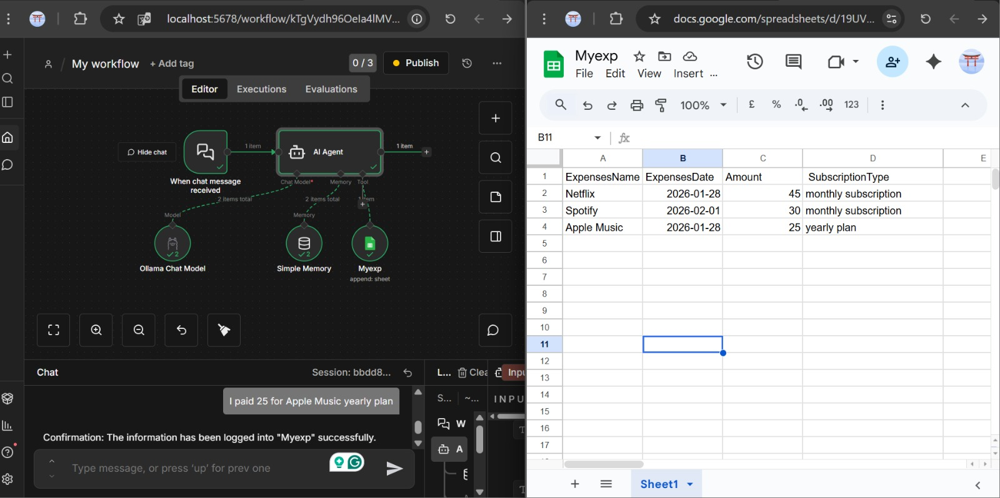

# AI Expense Tracker Agent (n8n)

An AI-powered expense tracking system that converts natural language input into structured financial data using n8n workflows.

## 💡 Description
This project allows users to input expenses in plain English (e.g., "I paid 45 for Netflix monthly subscription"), and the AI agent extracts and stores the data automatically in Google Sheets.

## ⚙️ Features
- Natural Language Processing (AI Agent)
- Automated workflows using n8n
- Google Sheets integration
- Real-time expense tracking
- Smart data extraction

## 🛠️ Technologies Used
- n8n
- AI Agent (LLM)
- Google Sheets API
- Ollama (Local Model)

## ▶️ How it Works
1. User sends expense text
2. AI Agent extracts:
   - Expense Name
   - Date
   - Amount
   - Subscription Type
3. Data is automatically stored in Google Sheets

## 📸 Screenshots

## 🚀 Future Improvements
- Add dashboard (Power BI)
- Add spending analytics
- Support multiple users
